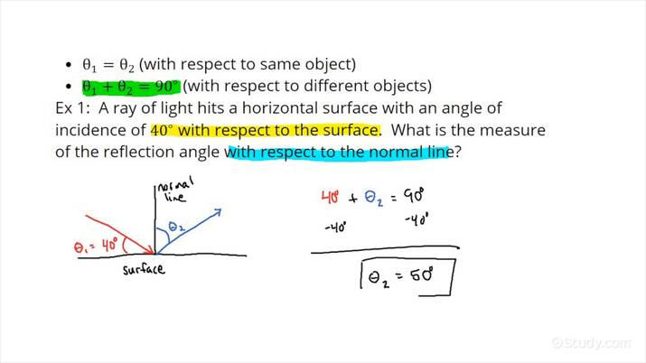
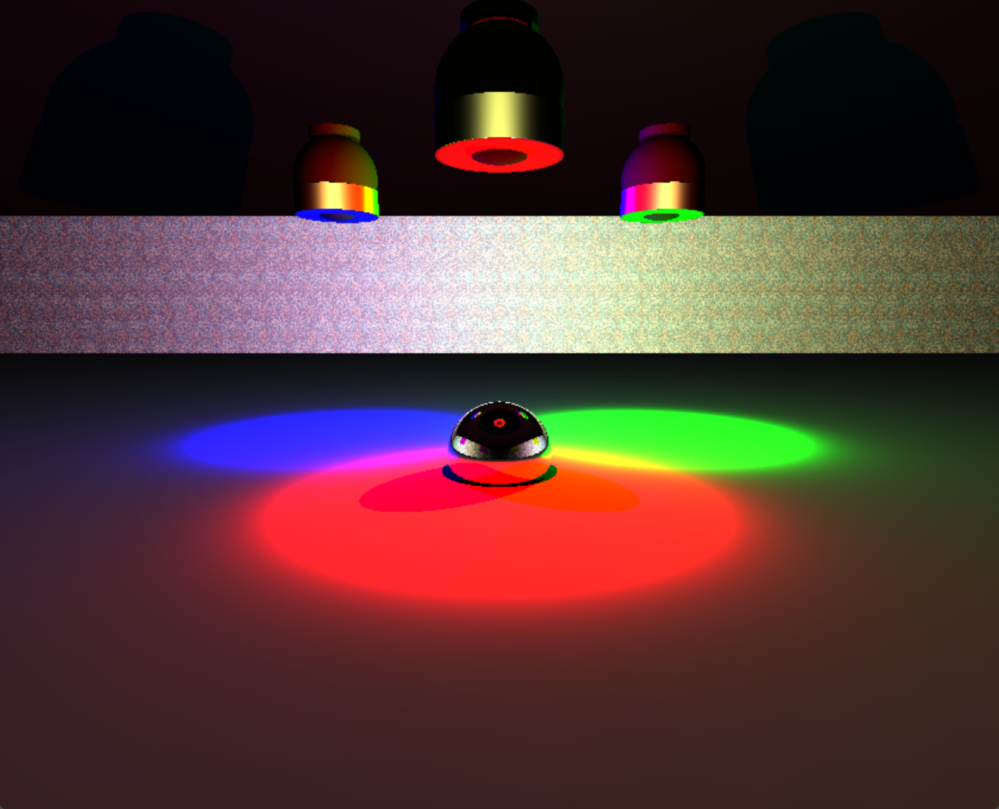
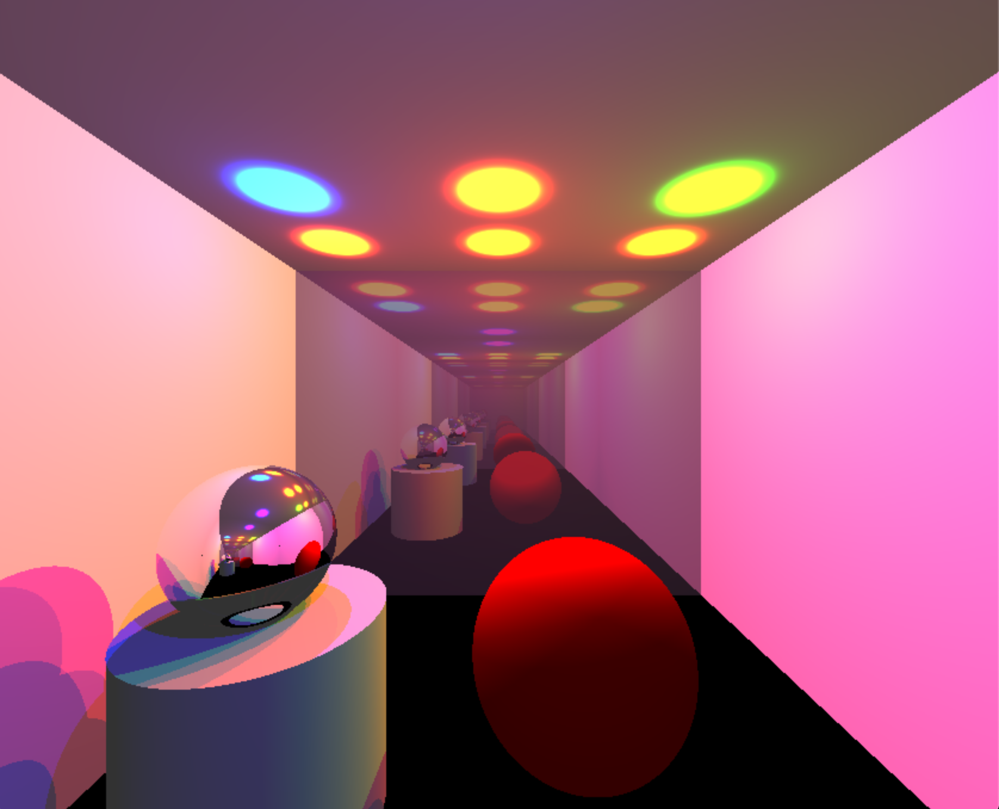
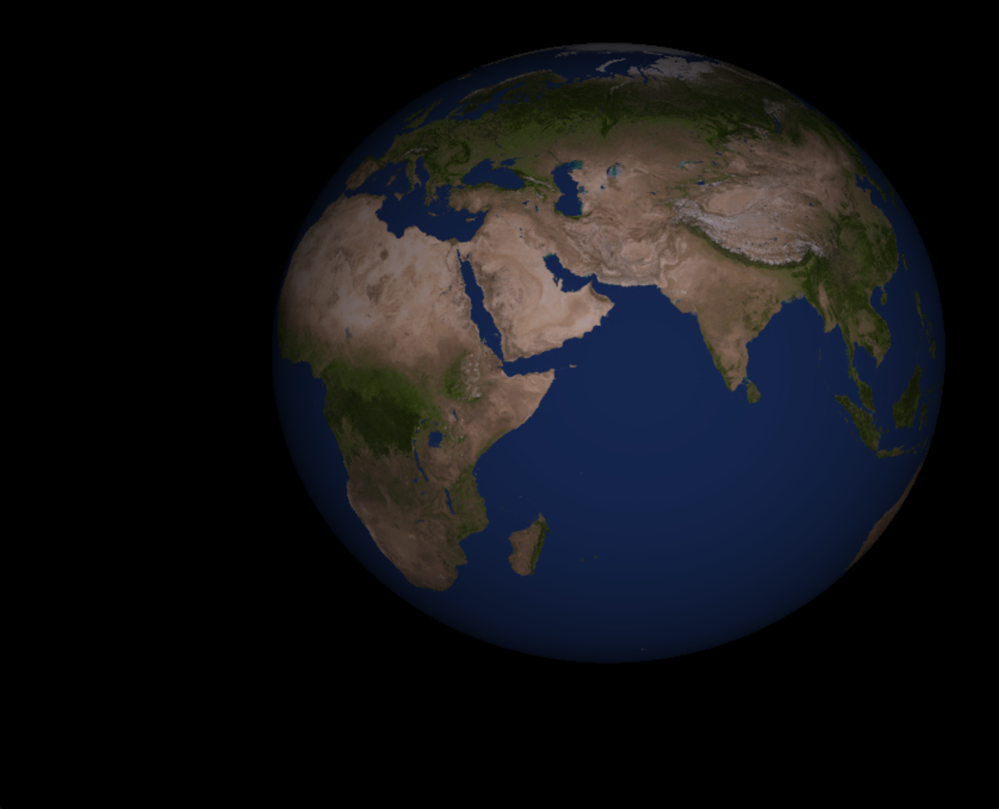
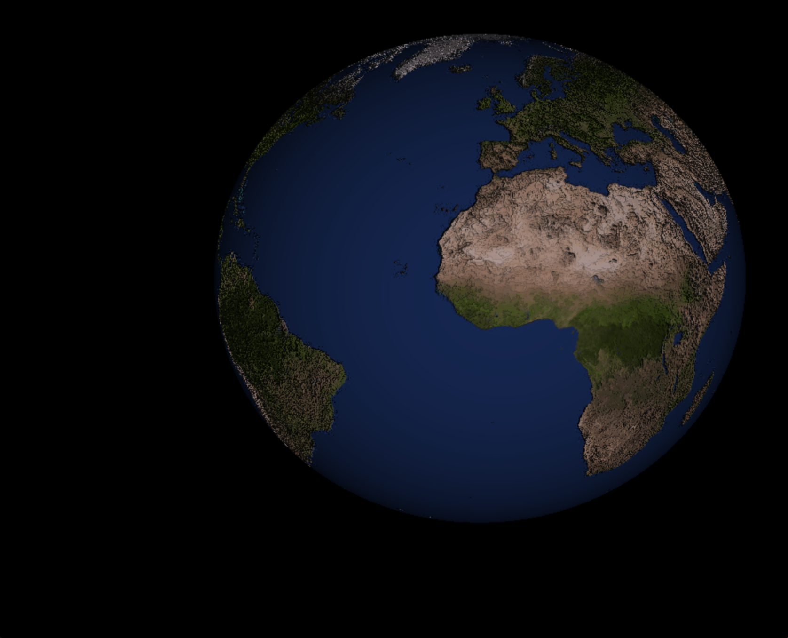
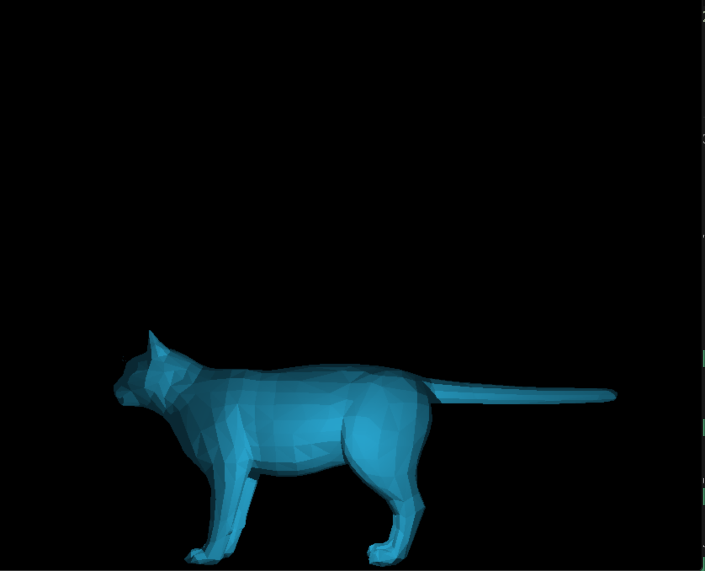
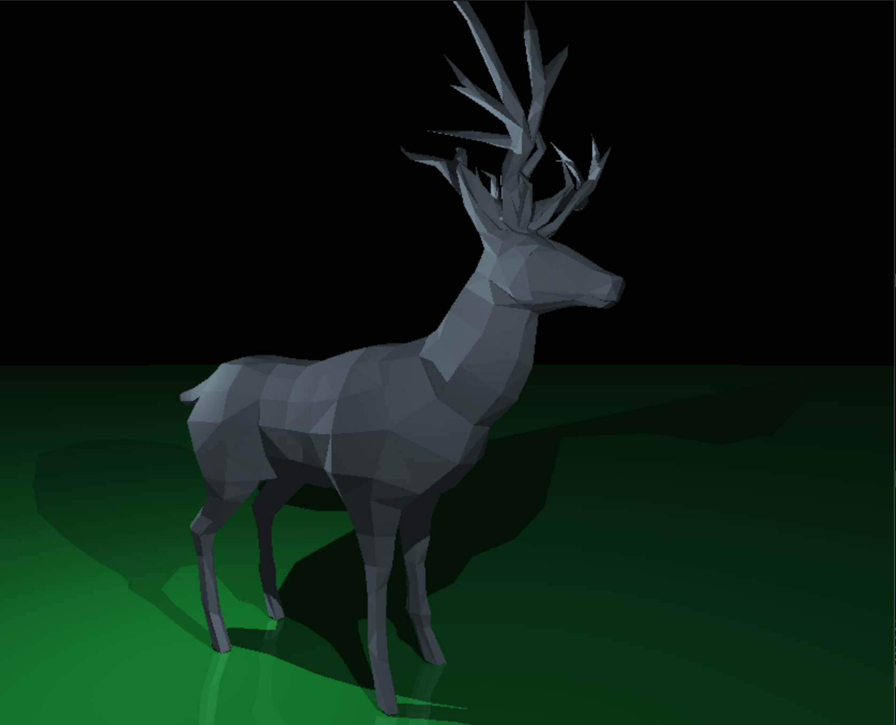
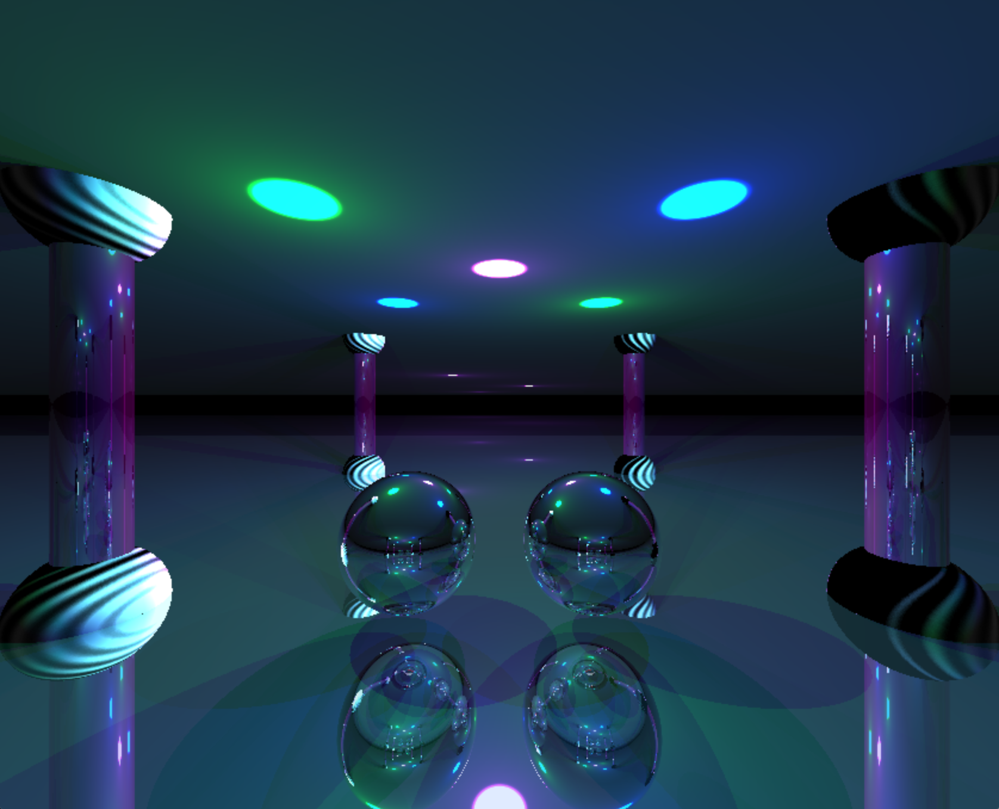

# miniRT

- miniRT is a simple ray tracer program that uses ray tracing as well as ray casting technique to simulate how light rays behave and interact with object in order to create realistic sceans.

- First let us discuss and wrap our walnut about Raytracing.

1-1) -*What is Ray tracing?*

-For a more general definition of ray tracing :
It's simply a computer graphics technique used to create realistic images by simulating the way light interacts with objects in a virtual 3D environment, so the mean idea is tracing the path of  individual rays of light as they travel from a virtual camera into the scene. These rays are traced as they bounced off surfaces, reflect, and interact with various materials and light sources. By simulating the behavior of light rays, ray tracing produces highly detailed and lifelike images with accurate lighting, shadows, and reflections.

1-2) Now we gonna hightlight some key point about Optics and how light behaves.

### Reflection: 
	
**specular reflection** When light encounters a surface,it  can bounce back.
this called reflection. `The angle at which light hits a surface is equal to the angel at which it reflects`. Mirrors work by reflecting light with hight precision.

(Law of reflection of a mirror, shiny or smooth surface).

**Diffuse Reflection** Normal objects, like ball or most everyday surfaces, exhibit diffuse reflection. Unlike mirrors, there surfaces are typically rough at the microscopic level.
When light hits a rough surface, it scratters in various directions. This means that the reflected light doesn't obey the low of refliction as precisly as with mirrors.

### Refraction  
When light pass from one transparent material into another 
(like air into water), it can change direction. This bending of light is called refraction. The amount of bending depends on the material's refractive indices.Lenses, like those on eyeglasses or cameras, use refraction to focus light.

Now after we have basic overview about the project, we reach the point where we gonna describe the process of rendering a ray traced image.

Ray tracing operates on a simple principle: tracing rays of light as they interact with objects in a scene. The process begins with casting rays from the eye (or camera) into the scene to the light source. Each ray serves as a virtual light beam, seeking to discover its interaction with objects.

1. Rays traverse the scene until they intersect with objects. This intersection helps determine what the ray hits, like a sphere, or any other geometric shape.

Visual representation of an ray-sphere intersection
Let’s take for example a ray-sphere intersection, this is usally done by using some math.
With an equation of the ray `P(t) = O + t⋅D`, where P(t) represents any point along the ray for a given parameter t, O and D are the origin and direction respectively, t is a scalar parameter that helps us move along the ray.
And the equation `x² + y² + z² = r²` of a sphere of radius r, placed at the origin(0, 0, 0) (to simplify the math, where transformations can be applied later).
After some expansion and simplification we get the ray-intersect equation of the form: (O + t⋅D)⋅(O + t⋅D) = r². Then we solve the equation for any given ray to know if we have an intersection at what point.
	
2. Shading and Illumination:

Upon intersection, the ray gathers information about the object’s surface, such as its color, texture, and material properties.
Rays calculate how light interacts with the surface — accounting for reflections, refractions, and shadows — using Phong-reflection model which is a classic shading model that combines ambient, diffuse, and specular components.

3. Recursive Ray Tracing:

Reflection and Refraction: If a surface is reflective or transparent, rays are spawned to simulate reflected or refracted light, creating realistic effects like mirrors or glass.
Recursive nature: This process can occur multiple times for each ray, simulating complex interactions between light and surfaces.
Given the recursive nature of this step, it’s crucial to set a limit on the number of recursions that yield acceptable results.

As rays bounce around the scene, they gather information about the color and intensity of light they encounter. This information contributes to forming the final image pixel by pixel.

As part of the bonus requirement, we were tasked with incorporating a bump texture — a technique employed to give the feeling of depth to an object without altering its geometry, to reduce computational cost. In my case, I utilized normal-mapping — a type of bump mapping. This technique allows for the manipulation of normals on objects, such as spheres, thereby creating a textured surface with a tactile bump effect.

more Sceans:

