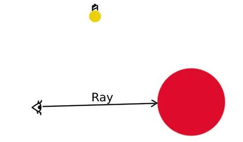
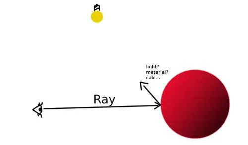
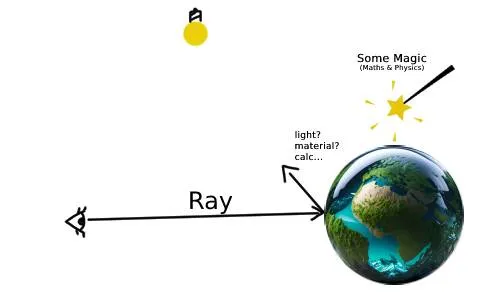
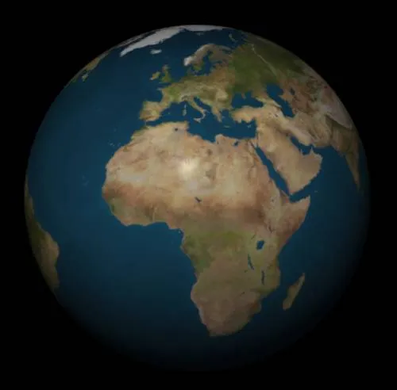
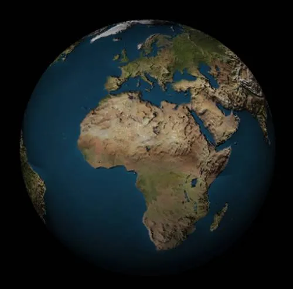
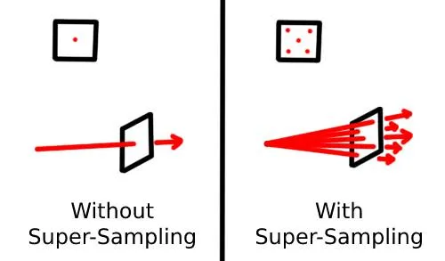
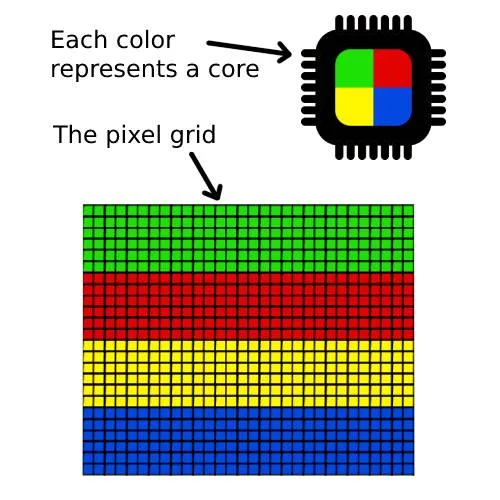
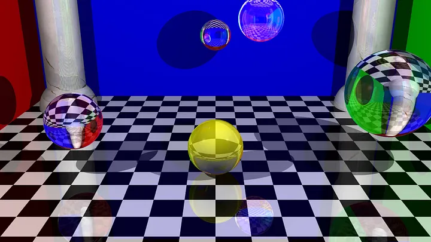
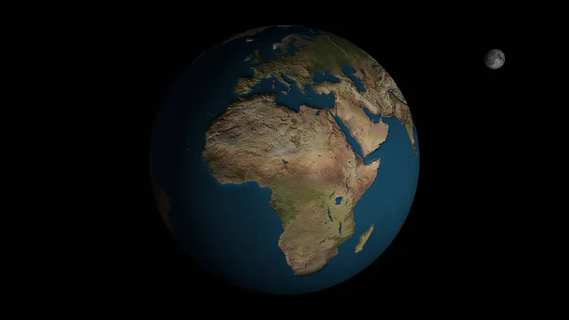
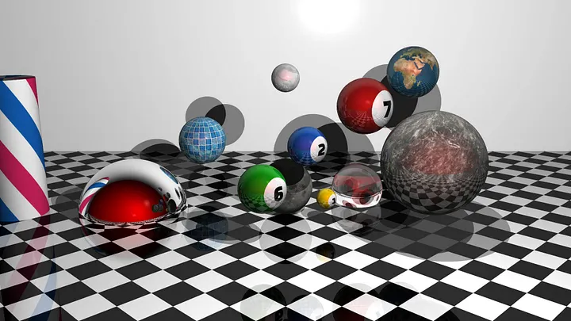

# 42 The Network Graphical Project

As a student of 
42 The Network
, I am constantly challenged to push the boundaries and explore diverse areas of computer science through many projects. One such project that stands out is miniRT, an engaging endeavor that delves into the world of computer graphics programming.

# So… What is miniRT?

miniRT is a graphical project within the curriculum of 42 that focuses on creating a simple ray tracer from scratch. A ray tracer is a computer program that uses some graphics technique to simulate the way rays of light interact with virtual objects to generate realistic images. In the case of miniRT, students are tasked with implementing a basic ray tracer in the C programming language… But that was not enough for me, because what really caught me into ray tracing, is the realism of scenes that get generated. So I opted to expand beyond the project's initial scope by incorporating additional elements:

— Reflections
— Refractions
— Color Texturing
— Super Sampling (to remove jaggy lines; to have a smooth appearance)
— Reading textures from PNG images
— Generating high quality PNG images

Here is one of the scenes that i generated using the ray tracer that i built:

A Graphical Scene Generated by a ray tracer program.
Click here for full resolution
I’ve engaged with numerous objectives within this project, enriching my comprehension of computer graphics principles with a deep understanding of computer graphics principles and honing my programming skills. Some of the key objectives include:

Graphics Pipeline: To understand the graphics pipeline, which involves stages like ray generation, intersection testing, shading, and image rendering. This hands-on experience provides a valuable insight into the intricate processes involved in creating realistic images.
Enhacement Techniques: That includes the various techniques to make a better program, like super-sampling, and multi-threading.
Implementation of Math and Science: As the subject of the project states “The main goal of miniRT is to prove to yourself that you can implement any mathematics or physics formulas without being a mathematician”. Truly, I found this to hold immense truth; in all honesty, this endeavor amplified my passion for both Mathematics and Physics.
Problem Solving: miniRT is not without its challenges, and students often encounter obstacles that require creative problem-solving. Some common challenges include managing memory efficiently, implementing complex algorithms for intersection testing, and dealing with mathematical transformations. However, these challenges provide invaluable learning opportunities. Students develop a resilience to problem-solving, learn to debug complex code, and gain a profound understanding of the inner workings of a ray tracer.
Now that we had a basic overview of the miniRT project, let’s take a quick trip describing the ray tracing process
Ray tracing operates on a simple principle: tracing rays of light as they interact with objects in a scene. The process begins with casting rays from the eye (or camera) into the scene to the light source. Each ray serves as a virtual light beam, seeking to discover its interaction with objects.

1. Rays traverse the scene until they intersect with objects. This intersection helps determine what the ray hits, like a sphere, or any other geometric shape.

Visual representation of an ray-sphere intersection
Let’s take for example a ray-sphere intersection, this is usally done by using some math.
With an equation of the ray `P(t) = O + t⋅D`, where P(t) represents any point along the ray for a given parameter t, O and D are the origin and direction respectively, t is a scalar parameter that helps us move along the ray.
And the equation `x² + y² + z² = 1` of a sphere of radius 1, placed at the origin(0, 0, 0) (to simplify the math, where transformations can be applied later).
After some expansion and simplification we get the ray-intersect equation of the form: (O + t⋅D)⋅(O + t⋅D) = 1. Then we solve the equation for any given ray to know if we have an intersection or not.

2. Shading and Illumination:

Upon intersection, the ray gathers information about the object’s surface, such as its color, texture, and material properties.
Rays calculate how light interacts with the surface — accounting for reflections, refractions, and shadows — using shading models like Phong or Lambertian… For our project we used the Phong-reflection model.

3. Recursive Ray Tracing:

Reflection and Refraction: If a surface is reflective or transparent, rays are spawned to simulate reflected or refracted light, creating realistic effects like mirrors or glass.
Recursive nature: This process can occur multiple times for each ray, simulating complex interactions between light and surfaces.
Given the recursive nature of this step, it’s crucial to set a limit on the number of recursions that yield acceptable results — Unless you wanna turn your computer into a toaster! 😂.

As rays bounce around the scene, they gather information about the color and intensity of light they encounter. This information contributes to forming the final image pixel by pixel.

As part of the bonus requirement, we were tasked with incorporating a bump texture — a technique employed to give the feeling of depth to an object without altering its geometry, to reduce computational cost. In my case, I utilized normal-mapping — a type of bump mapping. This technique allows for the manipulation of normals on objects, such as spheres, thereby creating a textured surface with a tactile bump effect.

This an example of a sphere with earth color texture:

Textured sphere without normal-mapping
This an example of a sphere with earth color texture + earth normal/bump texture:

Textured sphere with normal-mapping
Notice how normal mapping creates a sense of depth, without modifying the sphere’s geometry. Instead, it manipulates the normals, which determine how light interacts with each point on the sphere’s surface.

After I finished the ray tracing, I noticed that the quality of the image is not what I really was looking for, it was full of jaggy lines that steal the beauty of the scene… After doing some research i came across some techniques to remove those jaggy lines, among them was a method called Super-Sampling.

Super Sampling in a nutshell is having multiple samples per pixel to improve image quality. In other words, instead of casting one ray per pixel, we cast many rays per pixel and combine all colors into one, to get a smoother blending of colors.

Yes, indeed, Super Sampling significantly improves our final output, yielding a superior and smoother result. However, this enhancement comes at a cost — it requires more processing power. Instead of calculating just one ray per pixel, we now need to compute multiple rays based on our casting, leading to increased workload… Consequently, the rendering process slows down.
To address this issue and reduce rendering time, I turned to an old friend, the Philosophers project (a 42 project about multitasking with threads).

The idea is simple, since each pixel and ray is independent, we create multiple threads, where each thread manages a cluster of pixels, effectively distributing the workload across processor cores by dividing the total number of pixels in the canvas (image).

That’s it folks! I tried to highlight the key-aspects of the project without going too much into the nitty-gritty geeky math stuff…

The same as with most past projects, it’s about resilience, and willingness to know and learn — As the heart of the 42 Pedagogy. New concepts may be intimidating at first to get your head around, along with bugs and undefined behaviors… Yet, the essence lies in persisting despite these hurdles.
And to better demonstrate this, i want to show what my first rendered image looked like when i tried to render a red sphere:

Sphere?!
Yeah! It is definitely red, sure, but is it even a sphere?! 😂
As you can see, I wasn’t able to even render a proper sphere.

But with some dedication and resilience, i ended up with a much better and beautiful rendering:

# You can create image by passing a scene file ".rt" to the program "./miniRT"
## Check the "README.rt" file in "scenes/" to get an idea of how to write one.

# Usage:
## Compile the code using `make bonus`
## Create scenes using `./minirt_bonus <path_to_scene_file>`