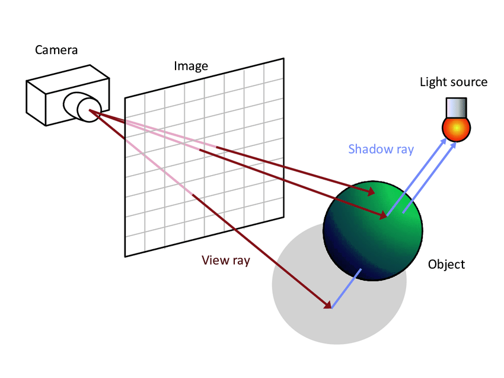
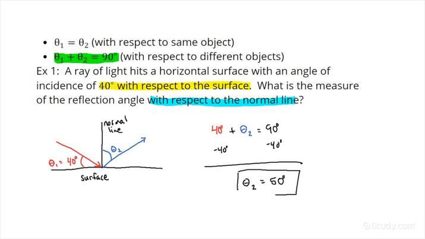
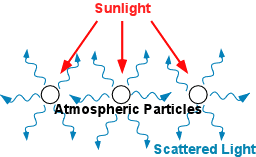

# Minirt

<Day00>

- First let us discuss and wrap our littel walnut about Raytracing.

	1-1) -*Wht is Ray tracing?*

	-For a more general definition of ray tracing :
	It's simply a computer graphics technique used to create realistic images by simulating the way light interacts with objects in a virtual 3D environment, so the mean idea is tracing the path of  individual rays of light as they travel from a virtual camera into the scene. These rays are traced as they bounced off surfaces, reflect, and interact with various materials and light sources. By simulating the behavior of light rays, ray tracing produces highly detailed and lifelike images with accurate lighting, shadows, and reflections.

	-Lets simplify more, ray tracing is like pretending you're a detective. Imagine you have a magical flashlight that can shoot out tiny beams of light. You use this flashlight to see how the light bounces around in a room filled with things like toys, furniture, and even a mirror.
	When you shine you flashlight, the light beams go out and bounce off these things, just like a ball bouncing off walls. Some of these beams might bounce off many times before they come back to your magical flashlight.

	Now, imagine you can follow these beams with your eyes and see where they go. You can figure out what things looks like by following how the beams bounce.
	This is what ray tracing does in computer.

	1-2) Now we gonna hightlight some key point about Optics and how light behaves.

		1-2-1 <Reflection>: 
			+ <specular reflection> When light encounters a surface, it can bounce back.
				this called reflection. `The angle at which light hits a surface
				is equal to the angel at which it reflects`. Mirrors work by
				reflecting light with hight precision.

			(Law of reflection of a mirror, shiny or smooth surface).

			+ <Diffuse Reflection>: Normal objects, like ball or most everyday
				surfaces, exhibit diffuse reflection. Unlike mirrors, there
				surfaces are typically rough at the microscopic level. When light
				hits a rough surface, it scratters in various directions. This
				means that the reflected light doesn't obey the low of refliction
				as precisly as with mirrors.

				Unlike in the last example with mirrors, where the angle of
				incidence equals to the angle of reflection, with deffuse
				reflection, there's no predictable relationship between the
				incomin and outgoin light angle.

		1-2-2 <Refraction> 
			When light pass from one transparent material into another (like
			air into water), it can change direction.
			This bending of light is called refraction. The amount of bending
			depends on the material's refractive indices.Lenses, like those on
			eyeglasses or cameras, use refraction to focus light.

		1-2-3 <Scattering> 
			When light interacts with small particles or irregularities in a
			material, it can scatter in all direction .

		1-2-3 <Inverse Square Law> 
			The intensity of light or its brightness decreases with distance
			from the source following the inverse square law. If you double
			the distance from light source, the intensity becomes one-fourth
			as strong.
